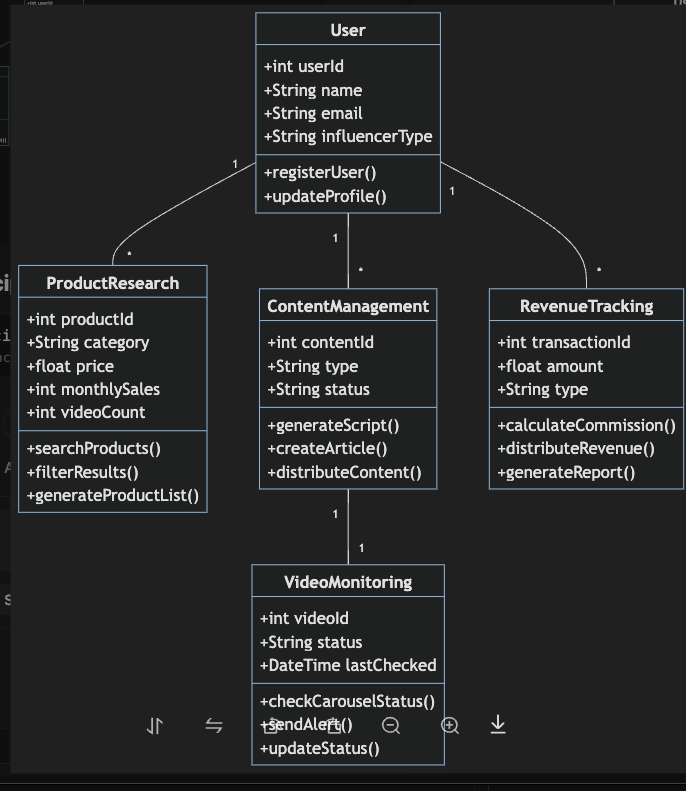
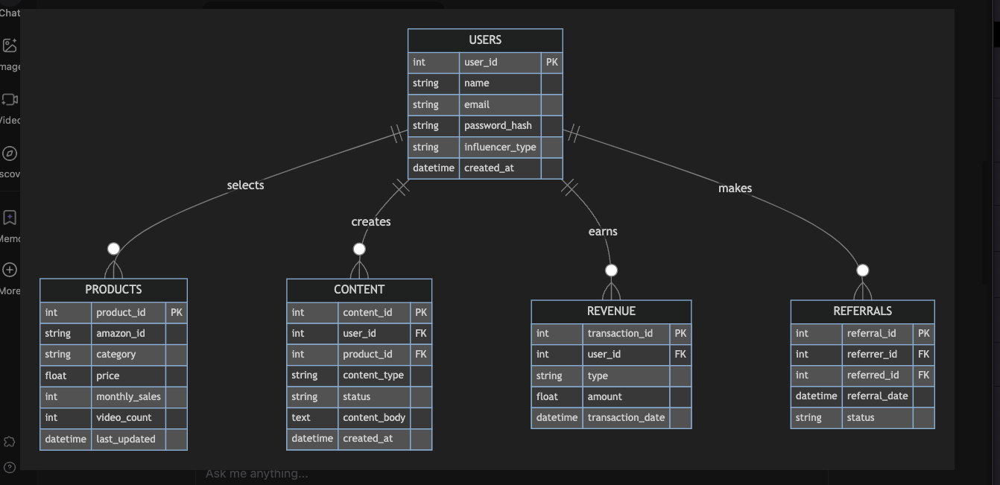

# Software Development Plan

## Diagrams 

###  System Class Diagram

### Database Schema

## Engineering Principles

# Engineering Principles and Guidelines

## 1. Architecture Principles

### 1.1 Microservices Architecture
- Separate core functionalities into independent services
- Enable independent scaling and deployment
- Ensure service isolation and resilience

### 1.2 API-First Design
- RESTful API design for all services
- Comprehensive API documentation
- Version control for APIs

## 2. Development Standards

### 2.1 Code Quality
- Follow SOLID principles
- Implement unit testing (minimum 80% coverage)
- Code review requirements
- Automated CI/CD pipeline

### 2.2 Security Standards
- OAuth 2.0 authentication
- Data encryption at rest and in transit
- Regular security audits
- GDPR compliance

## 3. Technical Stack

### 3.1 Backend
- Language: PHP
- Database: MySQL, Sqlite(for prototyping), JSON
- Cache: Redis
- Message Queue: RabbitMQ

### 3.2 Frontend
- Framework: JavaScript, Blade Templating Engine, 
- State Management: AlpineJS
- UI Components: Bootstrap (Prototyping), TailwindCSS (after MVP)
- Color Schema: 
- Images:
- Icons:
- 

### 3.3 Infrastructure
- Cloud: Hostinger Apache Server
- Container: Docker
- Orchestration: Kubernetes
- Mock Environment: Heroku
- Local Development Environment: Herd

## 4. Performance Requirements

### 4.1 System Performance
- API Response Time: 
- System Uptime: 99.9%
- Concurrent Users: 10,000+

### 4.2 Scalability
- Horizontal scaling capability
- Auto-scaling based on load
- Load balancing implementation

## 5. Monitoring and Maintenance

### 5.1 Monitoring
- Real-time system monitoring
- Error tracking and logging
- Performance metrics tracking

### 5.2 Backup and Recovery
- Weekly Automated backups of database through hostinger
- Disaster recovery plan
- Data retention policy
- ACID principles for data integrity

----

## AJ's Notes

- 
- use Factory Pattern in PHP
- object oriented fundamentals
- use JSONCrack for early API prototyping
- get data from bio, script log, emails to set up User Model, understand data structure
- able to handle data in multiple formats and file types and validate , verify, and sanitize it to fit our schema
- use bootstrap5 for initial prototyping , and then worry about ux design later
- Github branching strategy 
- API keys
- packages we need:

